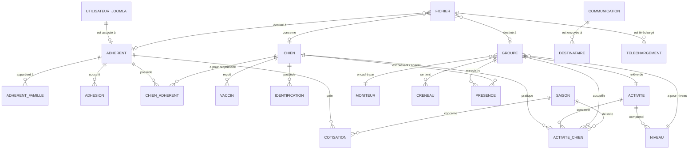

# Cahier des charges — Gestion des adhérents, des chiens et des documents

**Site Joomla du club cynophile** — version révisée (intègre la base documentaire)

---

## Ce qui a changé dans cette version

| Modification | Où |
|---|---|
| Ajout de la **base documentaire** (partage de fichiers avec des personnes autorisées) | Section 20 (nouvelle), sections 17, 25, 27, 29 |
| La base documentaire passe en **phase 1** (version simple), les raffinements en phase 2 | Section 29 |
| Ajout du profil **Adhérent (espace membre)** et du lien adhérent ↔ compte Joomla | Section 17.3, 25 |
| **Activités, niveaux, tarifs : modifiables sans code** (note « revoir les activités » intégrée) | Sections 7.2, 12 |
| **Statistiques à l'instant t et sur une période** (saison ≠ année civile) : phrase déplacée de la section 16 vers une vraie exigence, ajout de l'entité `SAISON` | Sections 14 à 16, 25 |
| Sections renumérotées à partir de la 20 | Sommaire |

---

## Sommaire

1. [Objet du projet](#1-objet-du-projet)
2. [Principe général](#2-principe-général)
3. [Gestion des chiens](#3-gestion-des-chiens)
4. [Propriétaires / adhérents](#4-propriétaires--adhérents)
5. [Gestion des familles](#5-gestion-des-familles)
6. [Relation chien / adhérent](#6-relation-chien--adhérent)
7. [Activités](#7-activités)
8. [Groupes et cours](#8-groupes-et-cours)
9. [Affectation chien → activité → groupe](#9-affectation-chien--activité--groupe)
10. [Vaccinations](#10-vaccinations)
11. [Cotisations](#11-cotisations)
12. [Calcul des cotisations](#12-calcul-des-cotisations)
13. [Présence aux cours](#13-présence-aux-cours)
14. [Statistiques de participation](#14-statistiques-de-participation)
15. [Statistiques financières](#15-statistiques-financières)
16. [Statistiques activités](#16-statistiques-activités)
17. [Gestion des utilisateurs et droits](#17-gestion-des-utilisateurs-et-droits)
18. [Gestionnaire vétérinaire / vaccinations](#18-gestionnaire-vétérinaire--vaccinations)
19. [Gestionnaire financier](#19-gestionnaire-financier)
20. [Base documentaire (partage de fichiers)](#20-base-documentaire-partage-de-fichiers)
21. [Communication ciblée](#21-communication-ciblée)
22. [Segmentation des destinataires](#22-segmentation-des-destinataires)
23. [Historique des communications](#23-historique-des-communications)
24. [Tableau de bord](#24-tableau-de-bord)
25. [Modèle de données recommandé](#25-modèle-de-données-recommandé)
26. [Points d'attention complémentaires](#26-points-dattention-complémentaires)
27. [RGPD et sécurité](#27-rgpd-et-sécurité)
28. [Architecture Joomla](#28-architecture-joomla)
29. [Priorités de développement](#29-priorités-de-développement)

---

## 1. Objet du projet

Le projet consiste à intégrer au site Joomla du club cynophile une solution de gestion permettant de centraliser :

- les chiens ;
- leurs propriétaires ;
- les adhérents ;
- les familles ;
- les activités pratiquées ;
- les groupes et niveaux ;
- les cotisations ;
- les vaccinations ;
- les présences aux cours ;
- **les documents et fichiers partagés avec les personnes autorisées** ;
- les statistiques ;
- les communications ciblées.

La **fiche chien** constitue l'entrée principale du système.

L'objectif est de disposer d'un outil permettant aux différents responsables du club d'accéder **uniquement aux informations nécessaires à leur fonction**, et aux adhérents de retrouver facilement **leurs** documents depuis le site.

---

## 2. Principe général

Le modèle fonctionnel doit respecter les relations suivantes :

```text
                    ADHÉRENT ◄────── compte Joomla (connexion)
                       │
             ┌─────────┴─────────┐
             │                   │
        plusieurs chiens       famille
             │
             ▼
           CHIEN
             │
      ┌──────┼──────────┬───────────┐
      │      │          │           │
      ▼      ▼          ▼           ▼
   Vaccins Activités  Présences   Fichiers
               │
               ▼
             Groupe ───────────────► Fichiers
```

Il faut prévoir une **relation plusieurs-à-plusieurs entre adhérents et chiens** :

```text
1 adhérent ──────── plusieurs chiens
     ▲                    ▲
     │                    │
     └──── plusieurs ─────┘
```

**Exemple :**

- **SAM**
  - Propriétaire 1 : Sandrine
  - Propriétaire 2 : Jean
- **Sandrine** possède : SAM, REX, NALA

---

## 3. Gestion des chiens

### 3.1 Fiche chien

Chaque chien possède une fiche unique.

**Informations obligatoires**

| Champ | Description |
|---|---|
| Numéro chien | Identifiant interne unique |
| Nom | Nom usuel du chien |
| Sexe | Mâle / Femelle |
| Date de naissance | Date |
| LOF | Oui / Non |
| Numéro LOF | Si applicable |
| Race | Race du chien |
| Numéro d'identification | Puce / tatouage |
| Date d'inscription au club | Date |
| Statut | Actif / Inactif / Parti |
| Photo | Facultative |
| Commentaire | Informations complémentaires |

**Exemple : SAM**

| Champ | Valeur |
|---|---|
| Sexe | Mâle |
| LOF | Oui |
| Date de naissance | 18/05/2021 |
| Race | English Setter |
| Identification | XXXXX |
| Statut | Actif |

---

## 4. Propriétaires / adhérents

Il faut **éviter** de stocker directement dans la table chien :

- Propriétaire 1
- Propriétaire 2
- Propriétaire 3

Il faut plutôt créer une **table Adhérent** et une **table de liaison**. Cela permettra d'avoir autant de propriétaires que nécessaire.

### 4.1 Fiche adhérent

| Champ | Description |
|---|---|
| N° adhérent | Identifiant unique |
| Nom | Nom |
| Prénom | Prénom |
| Email | Adresse email |
| Téléphone | Téléphone |
| Adresse | Adresse postale |
| Date de naissance | Facultatif |
| Date première adhésion | Date |
| Statut | Actif / Inactif |
| Type adhésion | Solo / Famille / Moniteur / Bienfaiteur |
| Cotisation | À jour / Non payée / Partielle |
| **Compte Joomla** | **Utilisateur Joomla associé (facultatif). Indispensable pour qu'un adhérent connecté retrouve ses chiens, ses groupes et ses documents.** |
| Commentaire | Facultatif |

> Un adhérent sans compte Joomla existe dans la base mais ne peut pas se connecter. Un compte Joomla ne doit être associé qu'à **un seul** adhérent.

---

## 5. Gestion des familles

Un adhérent principal peut être associé à plusieurs personnes.

**Exemple : Famille DUPONT**

- Adhérent principal : Jean DUPONT
- Membres : Marie DUPONT, Paul DUPONT, Julie DUPONT

Relation à prévoir :

```text
ADHÉRENT PRINCIPAL
        │
        ├── membre famille
        ├── membre famille
        └── membre famille
```

Chaque membre pourra éventuellement être associé à un ou plusieurs chiens.

---

## 6. Relation chien / adhérent

Cette relation est **essentielle**.

- Un chien peut avoir plusieurs adhérents.
- Un adhérent peut avoir plusieurs chiens.

Il faut donc prévoir une table `chien_adherent` :

| Chien | Adhérent | Relation |
|---|---|---|
| SAM | Dupont Jean | Propriétaire |
| SAM | Dupont Marie | Propriétaire |
| REX | Dupont Jean | Propriétaire |
| NALA | Martin Sophie | Propriétaire |

La colonne **Relation** pourra contenir :

- propriétaire principal ;
- copropriétaire ;
- responsable ;
- conducteur ;
- autre.

---

## 7. Activités

Les activités doivent être gérées comme **des données séparées** et non comme quatre colonnes fixes (Activité 1, 2, 3, 4). Un chien pourrait un jour pratiquer une cinquième activité.

```text
CHIEN
   │
   └── ACTIVITÉS
          ├── Obéissance
          ├── Agilité
          └── Hooper
```

### 7.1 Liste initiale des activités et niveaux

| Activité | Niveaux |
|---|---|
| **Obéissance** | Chiot, Adolescent, Obéissance 1, Obéissance 2, Obéissance 3 |
| **Obédience** | Brevet, Classe 1, Classe 2, Classe 3 |
| **Hooper** | Loisir, Compétition |
| **Agilité** | Loisir, Pré-compétition, Compétition |
| **Dog Dancing** | Dog Dancing |
| **Chien visiteur** | Chien visiteur |
| **Canicross / Canimarche** | Canicross, Canimarche |

> **À valider par le club.** Cette liste est un point de départ, pas une liste figée. Points à confirmer : « Obéissance » et « Obédience » sont-elles deux activités distinctes (loisir / compétition) ou une seule ? « Canicross / Canimarche » forment-elles une activité ou deux ?

### 7.2 Évolutivité : activités et niveaux modifiables sans code

Les activités et les niveaux sont des **données** que l'administrateur doit pouvoir :

- ajouter (une nouvelle activité apparaît dans les listes sans développement) ;
- renommer ;
- **désactiver** (statut actif / inactif) plutôt que supprimer, afin de conserver l'historique des chiens, groupes et statistiques qui s'y rapportent.

Même principe pour les autres listes de valeurs (types d'adhésion, relations, jours, types de documents) : à terme, elles doivent pouvoir être modifiées sans toucher au code. Dans la phase 1, certaines de ces listes sont des listes fixes dans le composant (modifiables par recompilation, voir le mode d'emploi, section 13).

---

## 8. Groupes et cours

Une activité ne suffit pas : il faut pouvoir définir **les cours réellement dispensés**.

**Exemple :**

```text
Activité : Obéissance
        │
        ├── Chiot          samedi 9h
        ├── Adolescent     samedi 10h
        ├── Obéissance 1   mercredi 18h
        └── Obéissance 2   mercredi 19h30
```

Un groupe doit pouvoir posséder :

- activité ;
- niveau ;
- jour ;
- heure ;
- moniteur responsable ;
- lieu ;
- capacité maximale ;
- statut actif/inactif.

---

## 9. Affectation chien → activité → groupe

Il faut pouvoir savoir précisément : **« SAM pratique quoi et avec qui ? »**

| Chien | Activité | Niveau | Groupe | Moniteur |
|---|---|---|---|---|
| SAM | Obéissance | Obéissance 2 | Groupe O2 | Dupont |
| SAM | Agilité | Loisir | Agility L1 | Martin |
| SAM | Canicross | Canicross | Groupe C1 | Durand |

Cette structure sera également indispensable pour les statistiques, et pour savoir **quels adhérents doivent voir les documents d'un groupe** (section 20).

---

## 10. Vaccinations

La gestion des vaccinations doit être **indépendante de la fiche chien**. Un chien peut avoir plusieurs vaccinations au cours de sa vie.

| Vaccin | Date vaccination | Date validité | Document | Statut |
|---|---|---|---|---|
| Vaccin X | 15/09/2026 | 15/09/2027 | PDF | Valide |
| Vaccin Y | 15/09/2026 | 15/09/2027 | PDF | Valide |

> **Important :** stocker la **date de validité**, et pas seulement la date de vaccination.

Le **document** vaccinal est un fichier de la base documentaire (section 20, type « Vaccination »), rattaché au chien.

Le système pourra alors calculer automatiquement le statut :

```text
Aujourd'hui
     │
     ▼
Date de validité du vaccin
     │
 ┌───┴────────┐
 ▼            ▼
Valide     Expiré
```

**Alertes à prévoir :**

| Indicateur | Signification |
|---|---|
| 🟢 | Valide |
| 🟠 | Expire bientôt |
| 🔴 | Expiré |
| ⚪ | Document manquant |

Le **délai d'alerte doit être paramétrable** (par exemple 30 jours avant expiration).

---

## 11. Cotisations

La cotisation ne doit pas être simplement un champ « Payé / Non payé ». Il faut **conserver l'historique**.

| Année (saison) | Adhérent | Type | Montant | Date paiement | Statut |
|---|---|---|---|---|---|
| 2026 | Dupont Jean | Famille | 180 € | 05/09/26 | Payée |
| 2025 | Dupont Jean | Famille | 175 € | 10/09/25 | Payée |

Cela permettra de produire les statistiques financières annuelles. La cotisation est rattachée à une **saison** (section 16), pas forcément à l'année civile.

---

## 12. Calcul des cotisations

La cotisation dépend de :

- type d'adhésion ;
- nombre de chiens ;
- nombre d'activités ;
- éventuellement, membre supplémentaire de la famille.

Il faut donc prévoir une **table de tarifs paramétrable** :

```text
TYPE ADHÉSION
      +
NOMBRE DE CHIENS
      +
NOMBRE D'ACTIVITÉS
      ↓
MONTANT COTISATION
```

Le gestionnaire ne doit **pas avoir à modifier le code** pour changer les tarifs d'une nouvelle saison.

**Exemple de paramétrage**

| Type | Chiens | Activités | Tarif |
|---|---|---|---|
| Solo | 1 | 1 | XX € |
| Solo | 1 | 2 | XX € |
| Famille | 2 | 2 | XX € |
| Moniteur | 1 | X | XX € |
| Bienfaiteur | - | - | XX € |

> Les règles exactes pourront être définies ultérieurement.

---

## 13. Présence aux cours

Le moniteur doit pouvoir ouvrir son cours (ex. **Obéissance 2 — 03/10/2026**) et obtenir :

| Chien | Présent | Absent | Commentaire |
|---|---|---|---|
| SAM | ☑ | | |
| REX | | ☑ | Malade |
| NALA | ☑ | | |

La présence doit être enregistrée avec :

- chien ;
- activité ;
- groupe ;
- date ;
- moniteur ;
- présence / absence ;
- éventuellement motif ;
- commentaire.

---

## 14. Statistiques de participation

Le système doit pouvoir calculer automatiquement, **par chien** :

- nombre de cours prévus ;
- nombre de présences ;
- nombre d'absences ;
- taux de participation ;
- évolution mensuelle ;
- évolution annuelle.

**Exemple : SAM**

```text
42 cours
36 présences
 6 absences
85,7 % de participation
```

Ces données pourront être utilisées par le moniteur comme **un indicateur parmi les critères** de passage dans un groupe supérieur.

> ⚠️ Le système **ne doit pas** faire passer automatiquement un chien de niveau sur la seule base de la présence : la décision reste celle du club / du moniteur selon ses règles.

---

## 15. Statistiques financières

Le gestionnaire financier doit pouvoir obtenir annuellement :

- nombre d'adhérents ;
- nombre d'adhérents actifs ;
- nombre de chiens ;
- nombre de cotisations payées ;
- nombre de cotisations impayées ;
- montant encaissé ;
- montant restant à encaisser ;
- répartition par type d'adhésion ;
- répartition par activité ;
- évolution par rapport à l'année précédente.

**Exemple**

```text
BILAN 2026

Adhérents actifs       125
Chiens                 143
Cotisations payées     118
Cotisations impayées     7
Recettes             XXXX €
```

---

## 16. Statistiques activités

Le système doit également pouvoir produire :

- nombre de chiens par activité ;
- nombre de chiens par niveau ;
- nombre d'adhérents par activité ;
- nombre de cours ;
- taux moyen de présence ;
- évolution annuelle des effectifs.

**Exemple**

```text
Obéissance
   Chiot          12 chiens
   Adolescent      8 chiens
   Niveau 1       15 chiens
   Niveau 2       11 chiens
   Niveau 3        6 chiens
```

### 16.1 Statistiques à l'instant t et sur une période

**Toutes** les statistiques des sections 14, 15 et 16 doivent pouvoir être produites :

- **à l'instant t** : situation à une date donnée (par exemple « combien de chiens en Agilité au 03/10/2026 ? ») ;
- **sur une période** choisie librement, y compris une **saison** dont les dates ne correspondent pas à l'année civile (par exemple du 1er septembre au 31 août).

Conséquences sur le modèle de données :

- définir une table **Saison** (libellé, date de début, date de fin), paramétrable ;
- dater les affectations (date de début et de fin dans `activite_chien`) et les cotisations (saison) ;
- ne jamais écraser l'ancienne situation : voir l'historisation (section 26.5).

---

## 17. Gestion des utilisateurs et droits

Il est fortement recommandé de créer des **profils fonctionnels**, plutôt que de donner accès à toute la base. Les profils s'appuient sur les **groupes d'utilisateurs** et **niveaux d'accès** natifs de Joomla.

### 17.1 Administrateur

Accès complet : chiens, adhérents, activités, groupes, utilisateurs, cotisations, vaccinations, **documents**, statistiques, communications, paramétrage.

### 17.2 Moniteur

Accès **uniquement** aux données nécessaires à ses cours.

**Il peut voir :**

- les chiens de ses groupes ;
- les propriétaires ;
- l'activité ;
- le niveau ;
- l'historique de présence ;
- **les documents destinés aux moniteurs et ceux de ses groupes**.

**Il peut :**

- enregistrer une présence ;
- signaler une absence ;
- ajouter un commentaire ;
- éventuellement proposer un changement de groupe / niveau ;
- **déposer un document pour l'un de ses groupes** (à confirmer).

**Il ne doit pas nécessairement voir :**

- les informations financières ;
- toutes les données personnelles ;
- les autres groupes.

### 17.3 Adhérent (espace membre)

Profil nouveau : l'adhérent **connecté** avec son compte Joomla.

**Il peut voir :**

- la liste des documents qui le concernent : documents du club, documents de ses groupes, documents de ses chiens, documents qui lui sont adressés personnellement ;
- ses propres chiens (consultation).

**Il ne voit pas :**

- les données des autres adhérents ;
- les documents des autres groupes ou des autres chiens ;
- les informations financières et vétérinaires des autres.

Ce profil impose que chaque adhérent concerné soit relié à un compte Joomla (section 4.1).

---

## 18. Gestionnaire vétérinaire / vaccinations

**Accès :**

- liste des chiens ;
- propriétaires ;
- vaccinations ;
- dates de validité ;
- documents vaccinaux (fichiers de type « Vaccination »).

**Fonctions :**

- rechercher un chien ;
- vérifier ses vaccins ;
- voir les vaccins expirés ;
- voir ceux qui arrivent à échéance ;
- recevoir des alertes.

**Exemple d'alertes**

```text
🔴  7 chiens — vaccination expirée
🟠 12 chiens — expiration dans les 30 jours
```

---

## 19. Gestionnaire financier

**Accès :**

- adhérents ;
- types d'adhésion ;
- cotisations ;
- paiements ;
- statistiques financières ;
- documents de type « Administratif » (reçus, justificatifs de paiement).

**Il peut :**

- enregistrer un paiement ;
- consulter les impayés ;
- générer des relances ;
- produire le bilan annuel.

Il ne devrait **pas** avoir accès aux informations vétérinaires détaillées.

---

## 20. Base documentaire (partage de fichiers)

### 20.1 Objectif

Permettre au club de **déposer des fichiers** (PDF, images, documents bureautiques) et de les **partager uniquement avec les personnes autorisées**, avec un **affichage simple** depuis le site : une liste de documents que chacun consulte et télécharge après connexion.

### 20.2 Exemples d'usage

| Fichier | Qui le voit |
|---|---|
| Règlement intérieur, calendrier du club | Tous les adhérents connectés |
| Planning et consignes du groupe Obéissance 2 | Les adhérents ayant un chien dans ce groupe, et les moniteurs |
| Certificat de vaccination de SAM | Les propriétaires de SAM, le gestionnaire vétérinaire, l'administrateur |
| Reçu de cotisation | L'adhérent concerné, le gestionnaire financier |
| Documents de formation des moniteurs | Les moniteurs uniquement |

### 20.3 Fiche fichier

| Champ | Description |
|---|---|
| Titre | Libellé affiché dans la liste (obligatoire) |
| Description | Facultative |
| Fichier | Le fichier téléversé |
| Type | Vaccination / Administratif / Licence / Cours / Club / Autre |
| **Portée** | À qui s'adresse le fichier : **Club** (tous les adhérents), **Groupe**, **Chien**, **Adhérent**, **Moniteurs** |
| Groupe concerné | Si la portée est « Groupe » |
| Chien concerné | Si la portée est « Chien » |
| Adhérent concerné | Si la portée est « Adhérent » |
| Publié | Oui / Non (un fichier non publié n'est visible que des gestionnaires) |
| Niveau d'accès Joomla | Filtre complémentaire (Public, Inscrit, Spécial…) |
| Date de dépôt, auteur | Renseignés automatiquement |

### 20.4 Règle de visibilité

Un fichier est visible par un utilisateur connecté si **toutes** les conditions suivantes sont réunies :

1. le fichier est **publié** ;
2. l'utilisateur a le **niveau d'accès Joomla** du fichier ;
3. selon la **portée** :

| Portée | Visible par |
|---|---|
| Club | Tout adhérent connecté |
| Groupe | Adhérents ayant un chien affecté à ce groupe, moniteurs de ce groupe |
| Chien | Adhérents propriétaires de ce chien |
| Adhérent | Cet adhérent (et les membres de sa famille, à décider) |
| Moniteurs | Utilisateurs du groupe « Moniteurs » |

Les administrateurs et gestionnaires ont accès aux fichiers de leur domaine (voir sections 17 à 19).

### 20.5 Affichage côté site

- Une page « **Mes documents** » dans l'espace membre, accessible aux seuls utilisateurs connectés.
- Liste simple : titre, type, date, bouton **Télécharger**.
- Filtre par type et recherche par titre.
- La liste ne montre **que** les fichiers autorisés pour l'utilisateur connecté.

### 20.6 Protection des fichiers

Cacher un fichier dans une liste ne suffit pas : il faut aussi **interdire l'accès direct** à l'adresse du fichier.

- les fichiers sont stockés dans un **dossier non accessible directement** depuis internet ;
- chaque téléchargement passe par le composant, qui **vérifie les droits** avant d'envoyer le fichier ;
- les fichiers sont renommés à l'enregistrement (nom aléatoire) pour qu'aucune adresse ne soit devinable ;
- types de fichiers et taille maximale limités (par exemple PDF, JPG, PNG, DOCX ; 10 Mo) ;
- **journal des téléchargements** (qui, quel fichier, quand) pour les fichiers sensibles (phase 2).

### 20.7 Gestion par les responsables

Dans l'administration, les profils autorisés peuvent **ajouter, remplacer, dépublier et supprimer** un fichier, et choisir sa portée, sans intervention technique.

### 20.8 Alternative

Si la version développée dans le composant s'avère trop coûteuse, la base documentaire peut être confiée à une extension Joomla existante (DOCman, Phoca Download) pour les fichiers du club et par groupe. Le ciblage « par chien » et « par adhérent » reste alors à relier au composant `club`.

---

## 21. Communication ciblée

Fonctionnalité à intégrer dès le départ. Le système doit pouvoir **sélectionner automatiquement une population**.

| Cas d'usage | Exemple |
|---|---|
| Annulation | Envoyer à tous les participants du groupe Agility du samedi |
| Changement d'horaire | Envoyer aux personnes inscrites au cours Obéissance 2 |
| Vaccination | Envoyer aux propriétaires des chiens dont le vaccin arrive à expiration |
| Cotisation | Envoyer aux adhérents dont la cotisation n'est pas réglée |
| Inscription | Envoyer aux adhérents concernés par la campagne de renouvellement |
| Nouveau document | Prévenir les destinataires d'un fichier déposé (lien vers l'espace membre, **jamais le fichier en pièce jointe**) |

---

## 22. Segmentation des destinataires

Le système doit permettre de sélectionner :

- tous les adhérents ;
- un type d'adhérent ;
- une famille ;
- les propriétaires d'une activité ;
- les membres d'un groupe ;
- les propriétaires d'un chien ;
- les adhérents avec cotisation impayée ;
- les chiens avec vaccination expirée ;
- les chiens dont la vaccination expire prochainement ;
- les anciens adhérents ;
- les nouveaux adhérents.

Cela évitera de créer manuellement des listes d'emails. La même logique de ciblage sert à déterminer qui voit un fichier (section 20.4).

---

## 23. Historique des communications

Un **journal des communications** doit être tenu. Pour chaque campagne :

- date ;
- objet ;
- expéditeur ;
- destinataires ;
- groupe ciblé ;
- type de communication ;
- statut d'envoi.

**Exemple :** `03/10/2026 — Annulation cours Agility — 18 destinataires`

Ce journal assure la traçabilité des envois.

---

## 24. Tableau de bord

La page d'accueil de l'administration pourrait afficher :

```text
┌──────────────────────────────────────────┐
│          TABLEAU DE BORD CLUB            │
├───────────┬──────────┬──────────┬────────┤
│ Adhérents │  Chiens  │ Impayés  │ Vaccins│
│    125    │   143    │    7     │  12 ⚠  │
└───────────┴──────────┴──────────┴────────┘

⚠ Vaccinations arrivant à échéance : 12 chiens
⚠ Cotisations impayées             : 7 adhérents
📅 Cours aujourd'hui                : 6 groupes
📊 Présences                        : 87 % ce mois
📁 Fichiers déposés ce mois         : 9
```

---

## 25. Modèle de données recommandé

Entités minimales :



Entités associées :

- **ACTIVITE** → NIVEAU
- **GROUPE** → ACTIVITE, NIVEAU, MONITEUR, CRENEAU
- **COMMUNICATION** → DESTINATAIRES
- **SAISON** → période d'activité (dates de début et de fin paramétrables)
- **FICHIER** → type, portée, GROUPE / CHIEN / ADHERENT facultatifs, chemin de stockage protégé
- **TELECHARGEMENT** → journal (utilisateur, fichier, date) — phase 2

---

## 26. Points d'attention complémentaires

### 26.1 Identification du chien

- race ;
- numéro d'identification ;
- numéro LOF ;
- photo ;
- statut actif/inactif.

### 26.2 Relation avec l'adhérent

- propriétaire principal ;
- copropriétaire ;
- conducteur éventuel.

### 26.3 Vie du chien au club

- date d'arrivée au club ;
- date de départ ;
- motif de départ ;
- historique des activités ;
- historique des groupes.

### 26.4 Documents

Gérés par la **base documentaire** (section 20) :

- certificat de vaccination ;
- justificatifs ;
- documents administratifs ;
- licence ;
- autres documents du club.

### 26.5 Historisation

Point particulièrement important. Il faut pouvoir retrouver : **« Qui était dans quel groupe et à quelle période ? »** et non seulement connaître la situation actuelle. C'est cette historisation qui rend possibles les statistiques à l'instant t et sur une période (section 16.1).

---

## 27. RGPD et sécurité

Cette base contiendra des données personnelles. Le projet doit prévoir :

- gestion des droits par rôle ;
- accès restreint aux données ;
- mots de passe sécurisés ;
- sauvegardes (**base de données et dossier des fichiers**) ;
- journalisation des actions sensibles (dont les **téléchargements de fichiers sensibles**) ;
- suppression ou anonymisation des anciens adhérents selon les règles applicables (y compris leurs fichiers) ;
- limitation des données visibles selon le rôle ;
- **stockage des fichiers hors accès public et téléchargement contrôlé** (section 20.6) ;
- politique de conservation des données ;
- information des adhérents sur l'utilisation de leurs données.

Les données vétérinaires et documentaires doivent être accessibles **uniquement aux personnes qui en ont besoin**.

---

## 28. Architecture Joomla

Il est recommandé de **ne pas** partir immédiatement sur une application externe volumineuse.

```text
                      JOOMLA
                         │
          ┌──────────────┼───────────────┐
          │              │               │
      Site public   Espace membre   Administration
                     (connecté)           │
                  « Mes documents »  ┌────┼──────┬──────────┐
                          │          │    │      │          │
                          │       Chiens Adhérents Fichiers ...
          │              │               │
          └──────────────┴───────────────┘
                         │
              BASE MYSQL  +  DOSSIER DE FICHIERS PROTÉGÉ
```

La base Joomla étant déjà en MySQL/MariaDB, les données peuvent être construites autour de Joomla, tout en conservant une **séparation correcte entre les fonctionnalités du CMS et les données métier du club**. Les fichiers eux-mêmes ne sont pas stockés dans la base : la base contient leur description et leur chemin, le fichier est dans un dossier protégé.

---

## 29. Priorités de développement

Le projet est découpé en **4 phases**.

### Phase 1 — Socle

- Adhérents (avec lien vers le compte Joomla)
- Familles
- Chiens
- Relation chien / adhérent
- Activités
- Niveaux
- Groupes
- Utilisateurs et droits
- **Base documentaire simple** : dépôt de fichiers, portée (club / groupe / chien / adhérent / moniteurs), page « Mes documents », téléchargement protégé

### Phase 2 — Gestion quotidienne

- Vaccinations (liées aux documents vaccinaux)
- Cotisations
- Saisons
- Présences
- Historique des groupes
- **Base documentaire avancée** : journal des téléchargements, catégories, dépôt par les moniteurs, notification de nouveau fichier

### Phase 3 — Statistiques

- Présence par chien
- Présence par groupe
- Statistiques activités
- Statistiques financières
- Tableaux de bord
- Statistiques à l'instant t et par période / saison

### Phase 4 — Communication

- Ciblage
- Campagnes email
- Relances cotisations
- Relances vaccinations
- Annulation de cours
- Changement d'horaires
- Renouvellement des inscriptions

---

## Point clé du projet

> Ne **pas** créer une table chien avec `activite1`, `activite2`, `activite3`, `activite4` et `proprietaire1`, `proprietaire2`, `proprietaire3`.
>
> Cela fonctionnerait au début, mais deviendrait rapidement limitant.

**Le bon modèle :**

| Relation | Cardinalité |
|---|---|
| Chien ↔ Adhérent | plusieurs-à-plusieurs |
| Chien → Activités | plusieurs |
| Activité → Chiens | plusieurs |
| Chien → Vaccinations | plusieurs |
| Chien → Présences | plusieurs |
| Groupe → Chiens | plusieurs |
| Moniteur → Groupes | plusieurs |
| Chien / Groupe / Adhérent → Fichiers | plusieurs |
| Adhérent ↔ Compte Joomla | un-à-un |

C'est ce modèle qui permettra ensuite de faire correctement **les statistiques, les relances automatiques, les filtres, le partage de fichiers et les droits d'accès** dans Joomla.