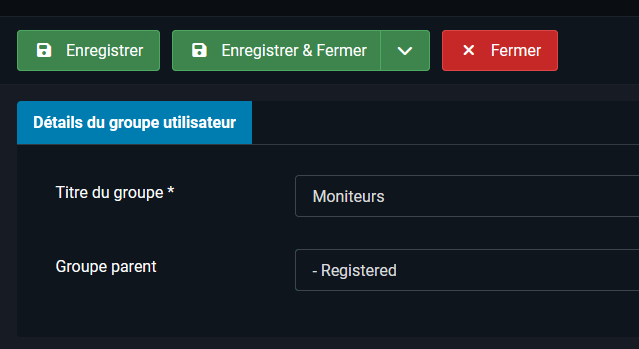

# Mode d'emploi — Démonstration sur le site de production avec données fictives

**Site Joomla du club cynophile — Phase 1 (socle)**

Ce document décrit comment réaliser la démonstration de la phase 1 directement sur le site réel, avec des **données fictives uniquement**.

> Faire la démonstration en production est possible, à condition de protéger le site. Les étapes 1 (sauvegarde) et 14 (nettoyage) ne doivent pas être ignorées.


## Sommaire

- [Avant de commencer](#avant-de-commencer)
- [Préparer les profils de test](#préparer-les-profils-de-test)
- [Générer et installer le composant](#générer-et-installer-le-composant)
- [Saisir les données fictives](#saisir-les-données-fictives)
- [Présenter au comité](#présenter-au-comité)
- [Après la démonstration](#après-la-démonstration)
- [Enregistrer dans Git](#enregistrer-dans-git)

---

## Avant de commencer

### Étape 1 — Faire une sauvegarde complète (deja disponbile)

1. Dans **Système > Installer > Extensions**, installer **Akeeba Backup** (gratuit).
2. Lancer une **sauvegarde complète**.
3. Télécharger le fichier `.jpa` sur votre ordinateur.


### Étape 2 — Vérifier la version de Joomla

Dans **Système > Informations système**, noter la version de Joomla et de PHP.

| Version | Conséquence |
|---|---|
| Joomla 5.x | La démonstration se déroule comme décrit ci-dessous. |
| Joomla 6.x | Component Creator cible Joomla 3, 4 et 5 : le composant généré risque de ne pas s'installer ou de mal fonctionner. Dans ce cas, restaurer la sauvegarde et revenir à un site de test local. |
| Joomla 4 ou moins | Fin de support : migration à prévoir avant tout. |

### Étape 3 — Choisir le bon moment

Réaliser l'installation **hors des périodes où des adhérents consultent le site**.

---

## Préparer les profils de test

### Étape 4 — Créer les groupes

**Utilisateurs > Groupes > Nouveau**, avec « Registered » comme groupe parent :

- `Moniteurs` Fait



- `Gestionnaire vétérinaire`
- `Gestionnaire financier`

### Étape 5 — Autoriser l'accès à l'administration

Un utilisateur du groupe « Registered » ne peut pas ouvrir l'administration par défaut.

1. Aller dans **Système > Configuration globale > Droits**.
2. Sélectionner chacun des trois groupes.
3. Mettre **Connexion à l'administration** sur **Autorisé**.


### Étape 6 — Créer les utilisateurs de test

**Utilisateurs > Gérer > Nouveau** :

| Utilisateur | Groupe | Email fictif |
|---|---|---|
| `moniteur.test` | Moniteur | `moniteur.test@example.com` |
| `veto.test` | Gestionnaire vétérinaire | `veto.test@example.com` |
| `finance.test` | Gestionnaire financier | `finance.test@example.com` |

- Utiliser des **mots de passe longs et uniques** : ces comptes existent sur un site public.
test avec 
moniteursandrine
Sam18052021@
mail laposte

---

## Générer et installer le composant

### Étape 7 — Générer le composant

Sur Component Creator, créer le composant `club` (version cible Joomla 5) avec les tables décrites dans `Cahier_des_charges.md`, Partie C :

`activite`, `niveau`, `adherent`, `chien`, `groupe`, `chien_adherent`, `activite_chien`.

> **N'activer aucune vue publique (front-end).** Le composant ne doit exister que dans l'administration.

### Étape 8 — Installer le composant

**Système > Installer > Extensions > Téléverser** le fichier `.zip`.

Le composant apparaît dans **Composants > Club**.

### Étape 9 — Vérifier qu'il n'est pas visible du public

1. Ouvrir une **fenêtre de navigation privée**.
2. Aller sur `https://clubcynophile-teyran.fr/index.php?option=com_club`.
3. Vérifier qu'**aucune donnée n'est affichée** (erreur 404 ou accès refusé).
4. Ne créer **aucun élément de menu** pour ce composant.

### Étape 10 — Régler les droits du composant

**Composants > Club > Options > Permissions**, pour chaque groupe :

| Groupe | Droits |
|---|---|
| Administrateur | Tout autoriser |
| Moniteur | Afficher uniquement |
| Gestionnaire vétérinaire | Chiens et adhérents en lecture seule |
| Gestionnaire financier | Adhérents en lecture seule |

Dans cette même fenêtre, autoriser **Accès à l'administration du composant** pour ces trois groupes.

---

## Saisir les données fictives

### Étape 11 — Règle d'or

**Aucune vraie donnée de membre** : ni nom, ni email, ni numéro de puce.

Préfixer chaque nom par `DEMO` (par exemple `DEMO Dupont Jean`, chien `DEMO SAM`). Cela permet de tout repérer et de tout supprimer facilement ensuite.

### Étape 12 — Ordre de saisie

Les liens exigent que les éléments liés existent déjà.

1. **Activités** : Obéissance, Agilité, Hooper.
2. **Niveaux** : Chiot, Obéissance 1, Obéissance 2, Loisir, Compétition.
3. **Adhérents fictifs** :
   - DEMO Sandrine ;
   - DEMO Dupont Jean ;
   - DEMO Dupont Marie (adhérent principal : Jean) ;
   - DEMO Martin Sophie.
4. **Chiens** : DEMO SAM, DEMO REX, DEMO NALA.
5. **Liens chien / adhérent** :

   | Chien | Adhérent | Relation |
   |---|---|---|
   | DEMO SAM | DEMO Sandrine | Propriétaire principal |
   | DEMO SAM | DEMO Dupont Jean | Copropriétaire |
   | DEMO REX | DEMO Sandrine | Propriétaire principal |
   | DEMO NALA | DEMO Martin Sophie | Propriétaire principal |

6. **Groupes** : Obéissance 2 (mercredi 19h30), Agility Loisir (samedi 10h).
7. **Affectations** : SAM → Obéissance 2 et Agility Loisir ; REX → Obéissance 2.

---

## Présenter au comité

### Étape 13 — Scénario

1. Ouvrir la fiche de **SAM** : deux propriétaires.
2. Ouvrir la fiche d'un adhérent avec plusieurs chiens.
3. Afficher la famille **Dupont**.
4. Montrer les affectations de **SAM** : activités, groupes, moniteurs.
5. Se connecter avec `finance.test`, puis `moniteur.test` : les accès diffèrent.
6. Présenter les phases 2 à 4 : vaccinations, cotisations, présences, statistiques, communications.

---

## Après la démonstration

### Étape 14 — Nettoyer

À faire le jour même ou après la validation :

1. **Supprimer les utilisateurs de test** (**Utilisateurs > Gérer**) : ce sont des comptes avec accès à l'administration sur un site public.
2. **Désactiver ou désinstaller le composant** (**Système > Gérer > Extensions**).
3. Dans phpMyAdmin, vérifier qu'**aucune table du composant** (`…_club_…`) ne subsiste, et la supprimer le cas échéant.
4. En cas de doute, **restaurer la sauvegarde Akeeba** : le site revient à son état d'origine.

### Étape 15 — Sécurité permanente

Activer l'**authentification à deux facteurs** sur tous les comptes administrateurs (menu du profil utilisateur).

---

## Enregistrer dans Git

Le dépôt doit contenir uniquement :

- le dossier du composant `com_club` (dézippé) ;
- le fichier `demo_data.sql` (**données fictives seulement**) ;
- le `README.md` ;
- le `.gitignore`.

Ne **jamais** y mettre `configuration.php` ni la sauvegarde `.jpa`.

```bash
git add .
git commit -m "Démo phase 1 : composant club et données fictives"
git push
```